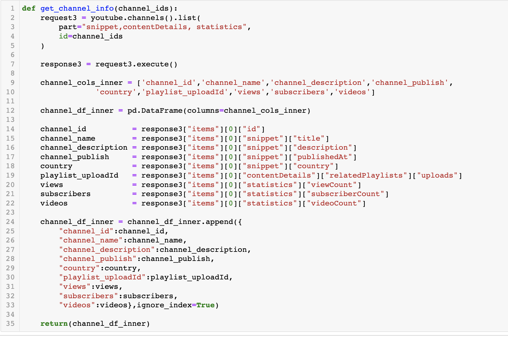
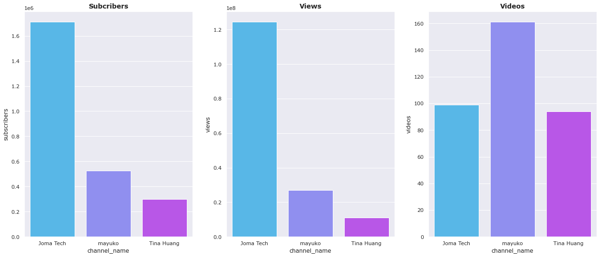
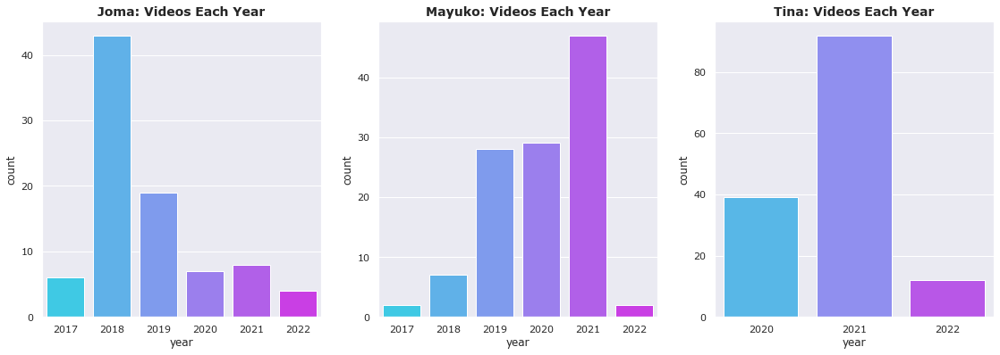
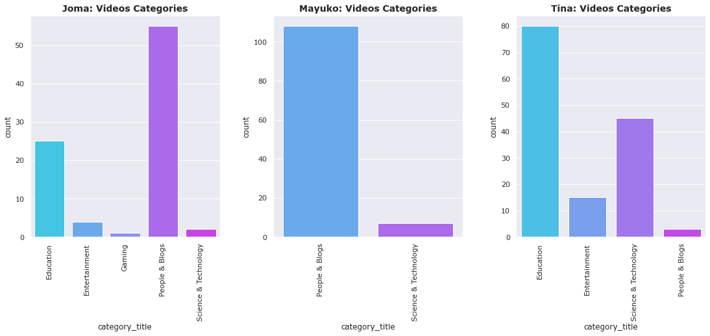
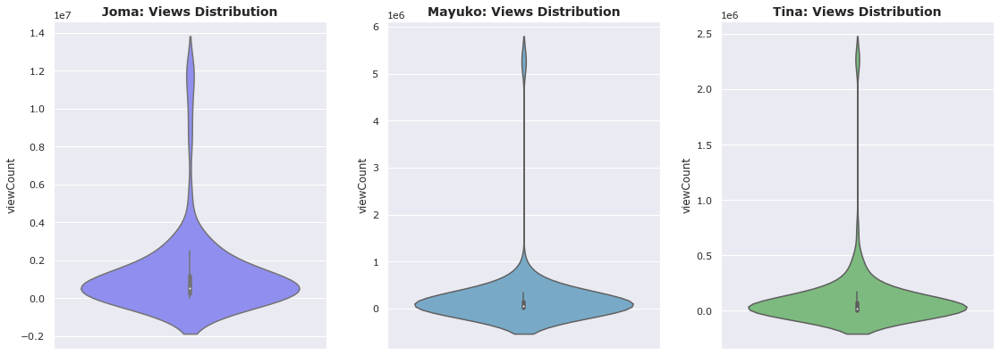
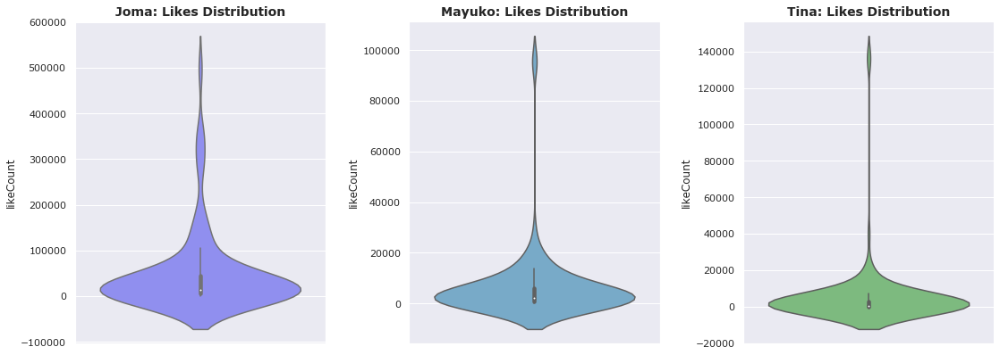
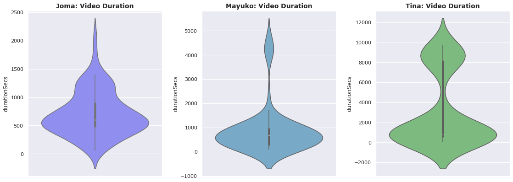
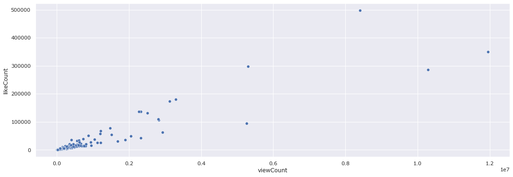

# EDA_YouTubers

## Overview

* Visualize and analyze choosen YouTubers in Data Science and Sotfware engineer fields, **Joma, Mayuko,Tina**.

## Data Source and Preparation

* **YouTube Data V3 API with endpoints** 
* **Channel list**
* **Playlist list**
* **Video list**

## Visualization/EDA

### Channel Info

___
### Videos Each Year

___
### Videos Categories

___

### Views Count

___
### Likes Count

___
### Videos Duration

___
### Views vs Likes

___
